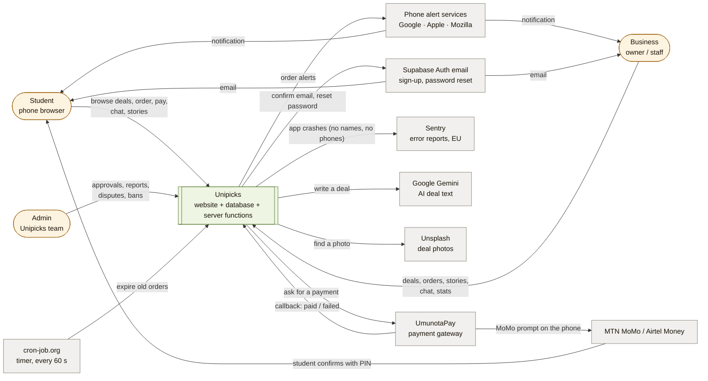

# 1. The whole ecosystem

*Checked 2026-10-05 against the code (`src/`, `supabase/functions/`), the live
Supabase project `dylgephsnywowxxasifs` and `docs/audits/ecosystem-flow-audit.md`.*

Who uses Unipicks, and every outside service it talks to.

## The people

| Who | Uses | Main things they do |
|---|---|---|
| **Student** | Phone browser (the website, can be added to the home screen) | Find deals, order alone or in a group, pay with MoMo, collect with a pickup code, chat, stories, report, dispute |
| **Business** | Phone or laptop | Register (needs approval), create deals, accept/decline orders, see stats, post stories, chat with students who ordered |
| **Admin** | Laptop | Approve businesses, handle reports (24 h) and disputes, ban, see analytics and the activity log |

## The outside services

| Service | Why Unipicks needs it | How it connects | If it is down |
|---|---|---|---|
| **UmunotaPay** | Takes MoMo / Airtel payments | Server function `process-payment` → `api.umunotapay.com` (API key + signature); UmunotaPay → `payment-webhook` (callback, signed) | Students cannot pay; orders wait, then expire. Late payments are still accepted when the callback arrives. |
| **MTN MoMo / Airtel** | The student's money | Only through UmunotaPay | Same as above |
| **Phone alert services** (Google FCM, Apple, Mozilla) | Order alerts on phones ("New order", "Order accepted", "Payment received") | Server functions send Web Push (`_shared/web-push.ts`, VAPID keys) | Alerts don't arrive; the bell inside the app still shows them |
| **Sentry** (EU) | Tells us when the app crashes | Website sends error reports (`src/lib/monitoring.js`); no names, emails or phones | We stop seeing crashes; the app works |
| **Google Gemini** | AI writes deal text for businesses | Server function `generate-deal` | "Generate with AI" fails; businesses can still type deals |
| **Unsplash** | Suggests a photo for an AI deal | Server function `generate-deal` | No suggested photo |
| **cron-job.org** | Timer: closes orders nobody answered or paid | Calls `expire-orders` every 60 s with a secret header | Old orders stay "waiting" until someone opens them (the server also checks when a business acts) |
| **Supabase Auth email** | Sign-up confirmation, password reset | Supabase sends it with our templates (`docs/email-templates/`). Which mail sender is used is **[inference: Supabase's built-in sender]** — to confirm in the Supabase dashboard; a custom domain + sender is still an open item | People cannot confirm accounts or reset passwords |

**Hosting** (where Unipicks itself runs) is on page 2: the website on
**Vercel**, everything else on **Supabase**, the code on **GitHub**.

## Not connected yet

- **Payouts to businesses**: not built; waiting for UmunotaPay's answer.
- **Refunds**: plan approved 2026-10-05 (`refund-plan`), not built yet.
- **Payment status check** (`reconcile-payments`): built, **switched off**
  (`RECONCILE_ENABLED` not set, no timer job).
