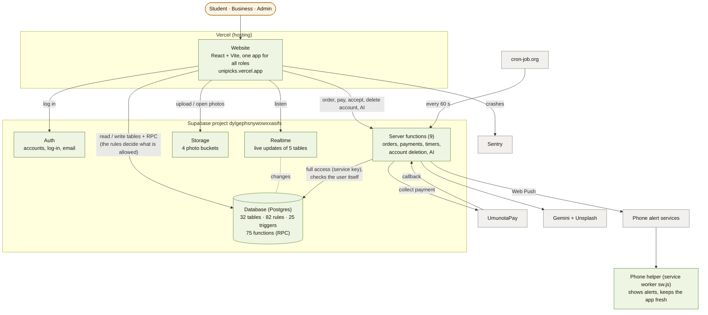
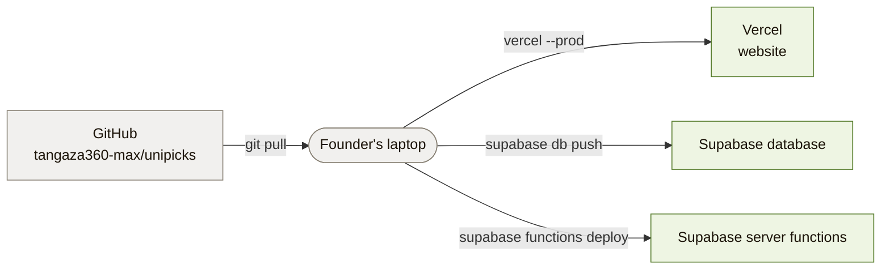

# 2. The building blocks

*Checked 2026-10-05 against the code and the live Supabase project
(`dylgephsnywowxxasifs`): 32 tables, 75 database functions, 25 triggers,
82 rules (policies), 9 server functions.*

What is inside Unipicks and how the parts talk to each other.

## Why the work is split this way

- **The website never decides alone.** It can only do what the database rules
  allow for the logged-in person. A changed or hacked app still cannot read
  someone else's orders or approve itself.
- **Anything with money or several steps runs in a server function**
  (create an order, pay, accept/decline, expire). They use the service key
  (full access), so each one **checks the user, the role and the order
  state itself** before acting.
- **Smaller rules live in the database** as triggers and functions, so they
  apply whoever writes (website, server function or admin): ban checks, deal
  prices, seller names, story rules, report alerts, account deletion.

## The website (`src/`)

| Part | Where | Notes |
|---|---|---|
| Screens | `src/pages/*` (36 pages) | One app; the role (student / business / admin) decides which screens show (`Dashboard.jsx`, `StudentLayout.jsx`) |
| Shared parts | `src/components/*` | `Button`, `BackLink`, `StatusBadge`, bottom bars, camera, story viewer, report dialog… |
| Helpers | `src/lib/*` | Supabase client, orders, payment, money/date format, prices, stories, camera maths, GIFs, phone alerts, monitoring |
| Phone helper | `public/sw.js` | Shows phone alerts, opens the right screen on tap, updates itself |
| Settings it needs | `VITE_SUPABASE_URL`, `VITE_SUPABASE_ANON_KEY`, `VITE_VAPID_PUBLIC_KEY`, `VITE_SENTRY_DSN`, `VITE_SUPPORT_EMAIL`, `VITE_UNIPICKS_REGISTRATION` | Public values only, never secrets |

## The server functions (`supabase/functions/`)

| Function | Called by | Login check | What it does | Talks to |
|---|---|---|---|---|
| `create-order` | Website (student) | Checks the user itself (Supabase check off) | Prices the deal on the server, creates the order, alerts the business | Phone alerts |
| `update-order-status` | Website (business) | Itself (off) | Accept / decline within the time limit; sends the student's message and alert | Phone alerts |
| `process-payment` | Website (student) | Itself (off) | Starts the MoMo payment for an accepted order | UmunotaPay, phone alerts |
| `payment-webhook` | **UmunotaPay** | Signed callback (secret) | Marks the payment paid / failed, creates the pickup code, alerts the business | Phone alerts |
| `create-group-order-payment` | Website (group host) | Supabase login check on | Turns a group into one order for the business | Phone alerts |
| `expire-orders` | **cron-job.org**, every 60 s | Supabase check on + secret header | Closes orders not answered (business) or not paid (student), closes old groups | — |
| `reconcile-payments` | (timer, **switched off**) | Supabase check on + secret header | Asks UmunotaPay about payments we never heard back from | UmunotaPay, phone alerts |
| `delete-my-account` | Website | Supabase check on | Deletes the account the safe way (keeps what accounting needs) | — |
| `generate-deal` | Website (business) | Supabase check on | AI deal text and a photo suggestion | Gemini, Unsplash |

Shared code: `_shared/` (phone alerts, alert texts, pickup-code message,
business standing check).

## Storage (photos)

| Bucket | Who can see | Used for |
|---|---|---|
| `deal-images` | Everyone (public links) | Deal photos |
| `story-images` | Everyone (public links) | **Business** stories |
| `merchant-logos` | Everyone (public links) | Business logos |
| `student-stories` | **Private**: only friends while the story is live, the owner, admins | Student stories (photos and GIFs, 5 MB) |

## Live updates (Realtime)

Switched on for: `chat_messages`, `deals`, `notifications`, `orders`,
`user_notifications`.

🟡 **Found while mapping:** the Home screen also listens for
`merchant_stories` (new business stories), but that table is **not switched
on** for live updates, so a new business story only appears after a reload.
Small fix (one database line), not done yet.

## Secrets (names only — values live in Supabase, never in code or chat)

`SUPABASE_SERVICE_ROLE_KEY`, `UMUNOTA_API_KEY`, `UMUNOTA_WEBHOOK_SECRET`,
`UMUNOTA_WEBHOOK_ALLOWED_IPS` (optional), `UMUNOTA_STATUS_ENDPOINT`,
`UMUNOTA_STATUS_METHOD`, `UMUNOTA_STATUS_AUTH_STYLE`, `RECONCILE_ENABLED`,
`CRON_SECRET`, `VAPID_PUBLIC_KEY`, `VAPID_PRIVATE_KEY`, `VAPID_SUBJECT`,
`GEMINI_API_KEY`, `UNSPLASH_ACCESS_KEY`.

## Where the code becomes the live app

Every change goes: branch on GitHub → founder pulls → founder deploys the
part that changed. Details and checklists: page 7.
