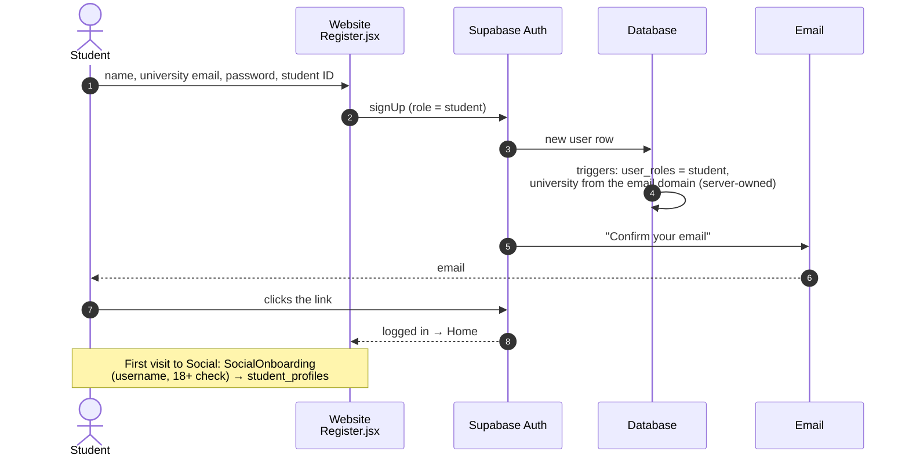
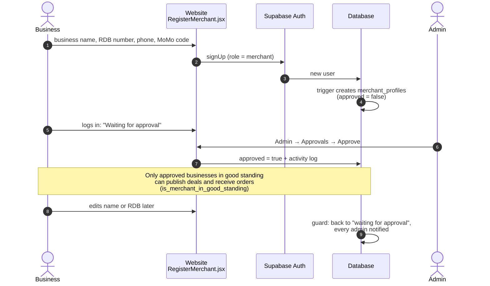
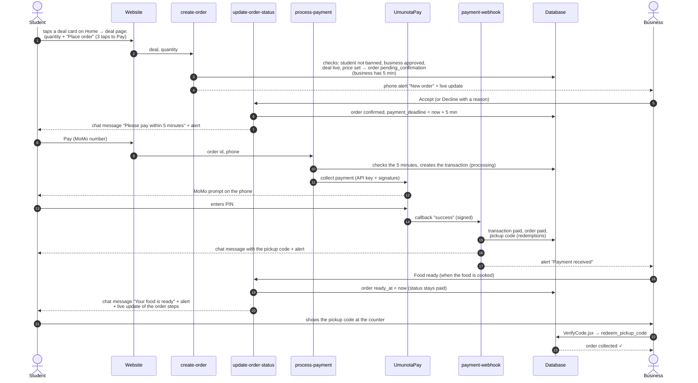
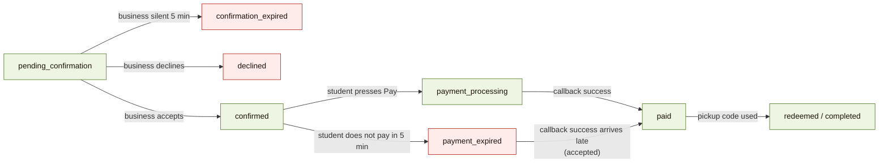
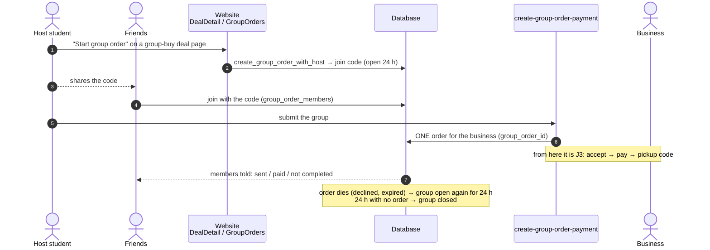
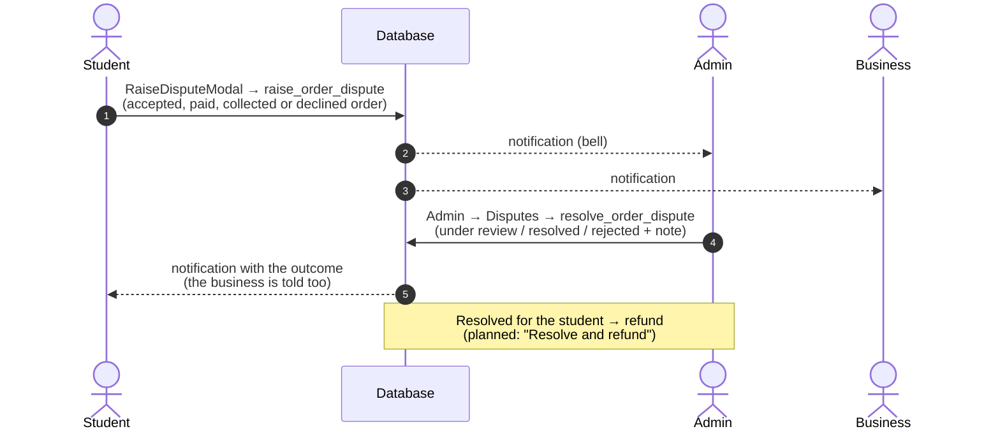
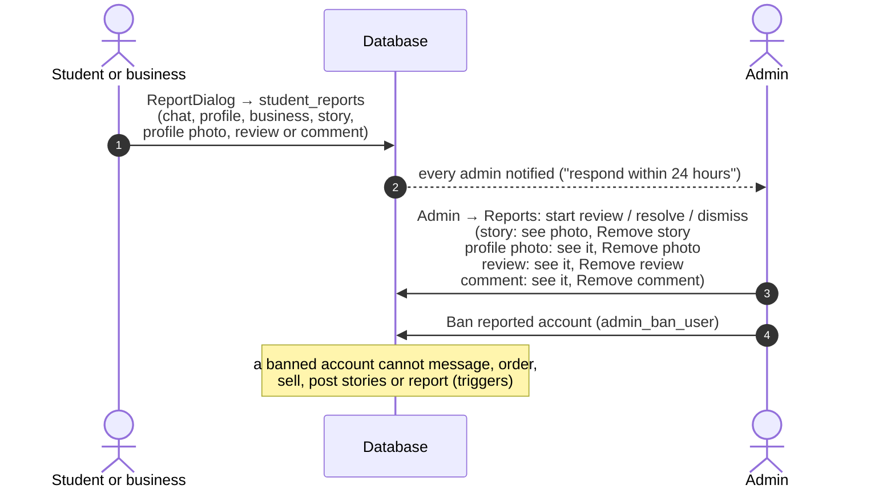
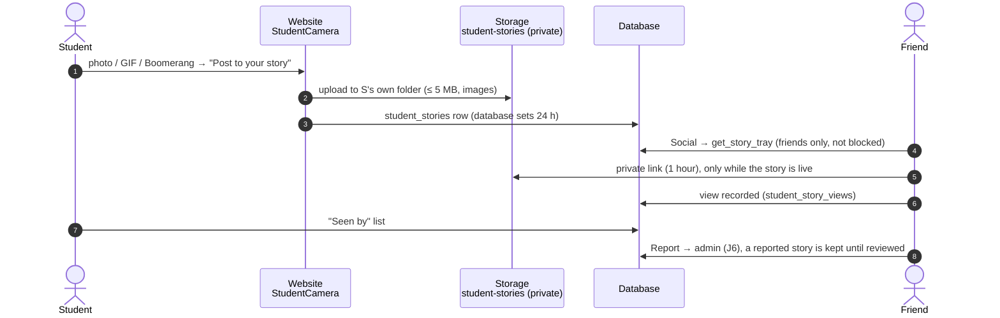
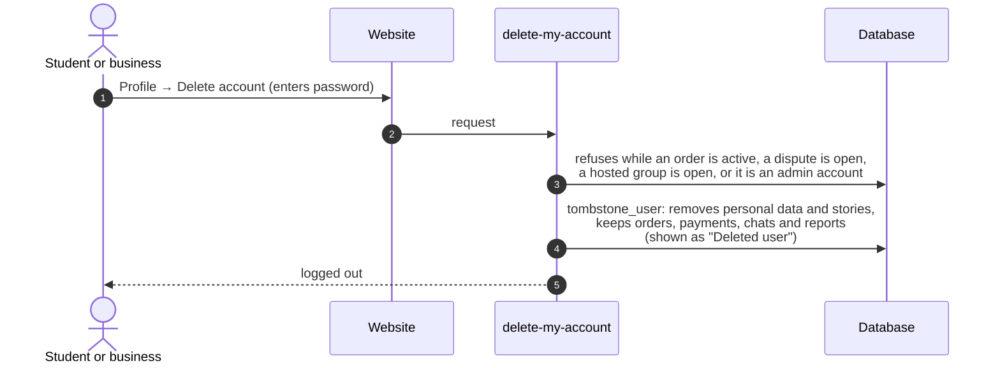

# 3. Main journeys, step by step

*Checked 2026-10-05 against the code (`src/`, `supabase/functions/`,
`supabase/migrations/`). Function and file names are given so a problem can
be traced to the exact place.*

Each journey: a diagram (who talks to whom, in order), what can go wrong, and
where the code is.

---

## J1. A student signs up

- **University comes from the email domain** (`keplercollege.ac.rw` → Kepler
  College), set by the database, so a student cannot pretend
  (`20261003190000_server_owned_verified_identity.sql`).
- **Can go wrong:** the confirmation email does not arrive (email sender, page 1);
  the person signs up twice with the same email (Supabase answers as if it worked,
  by design).

## J2. A business signs up and gets approved

- **Can go wrong:** a business changes its name to look like another one →
  automatic re-approval (`20261004120000_merchant_profile_self_edit.sql`).

## J3. A normal order: order → accept → pay → collect

**Timers** (`expire-orders`, called by cron-job.org every 60 s):

- **Late payments are accepted:** if the money arrives after the 5 minutes,
  the order still becomes paid; nobody pays for nothing.
- **Can go wrong:**
  - the callback never arrives → the order stays `payment_processing`;
    `reconcile-payments` is built to ask UmunotaPay but is **switched off**;
  - the business is not approved / banned → `create-order` refuses
    ("This business isn't taking orders right now.");
  - money must go back (sold out, dispute) → **refunds not built yet**
    (plan approved).

## J4. A group order

- Code: `20261003310000_group_order_lifecycle.sql`, `GroupOrders.jsx`,
  `create-group-order-payment`.

## J5. A dispute

## J6. Report and ban

## J7. Student stories

## J8. Deleting an account

---

**Not drawn yet (not built):** refunds (plan approved 2026-10-05), payouts to
businesses (waiting for UmunotaPay).
