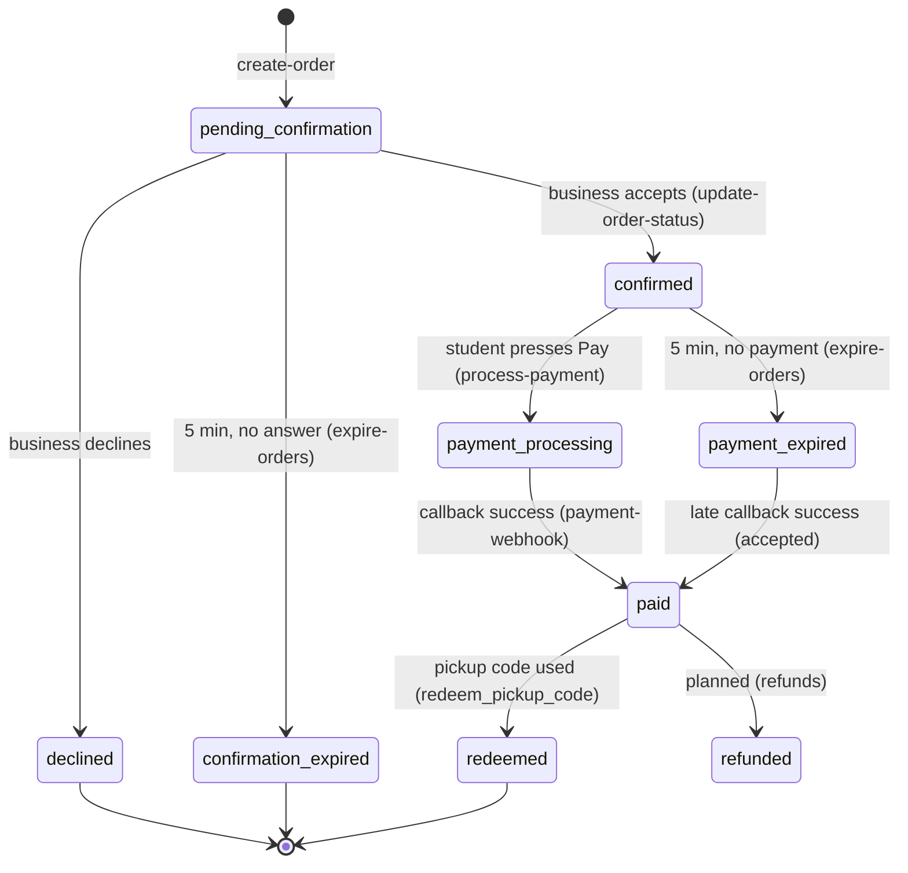
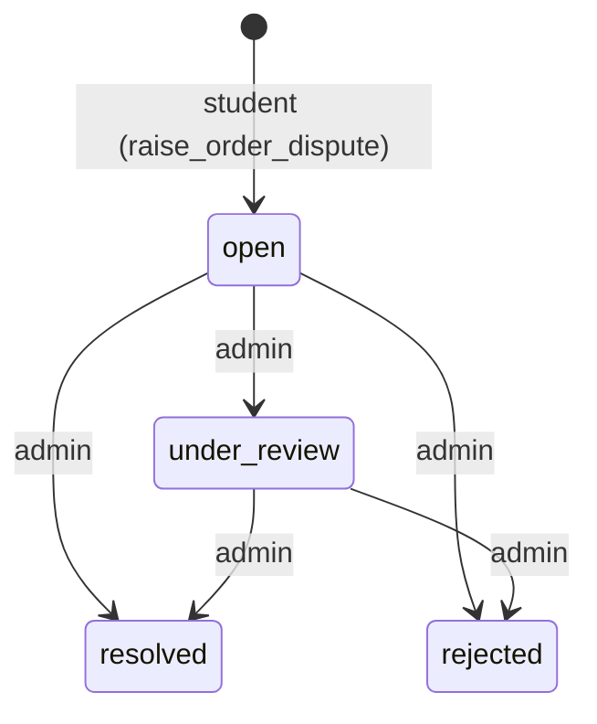
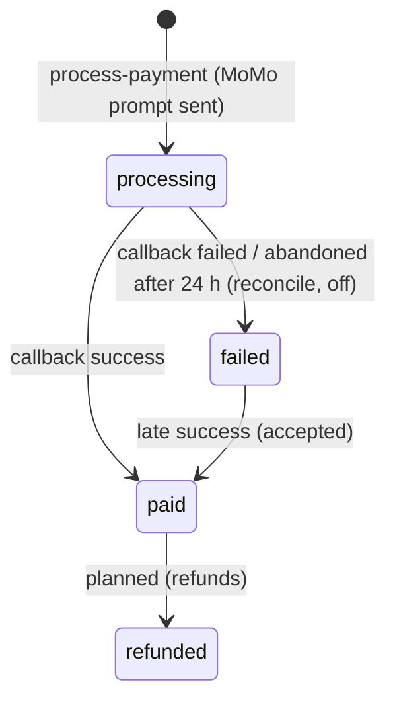
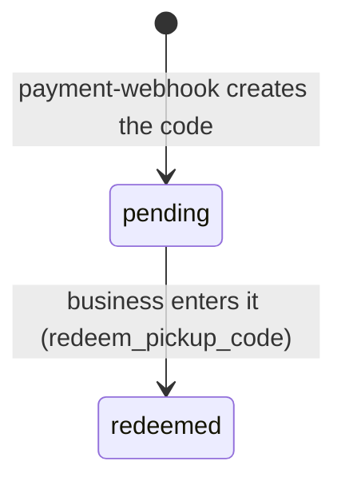
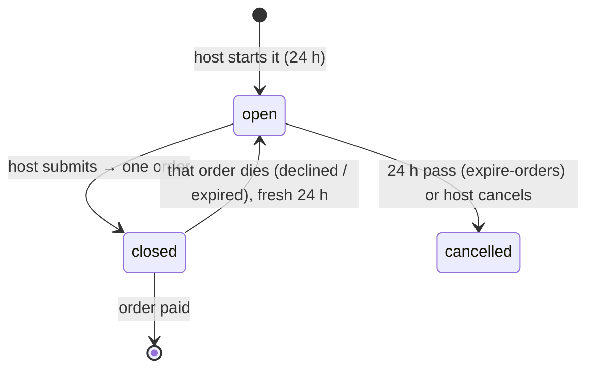
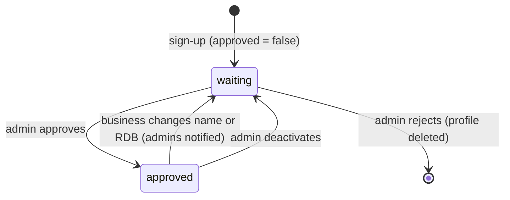
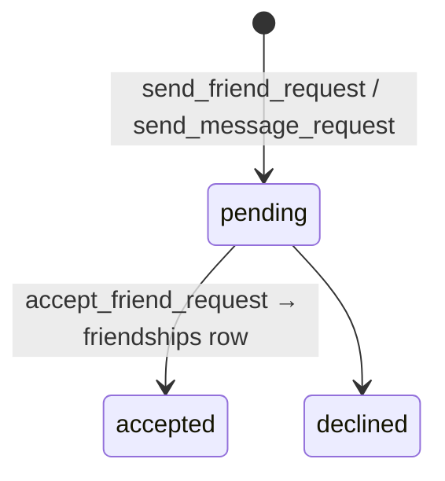
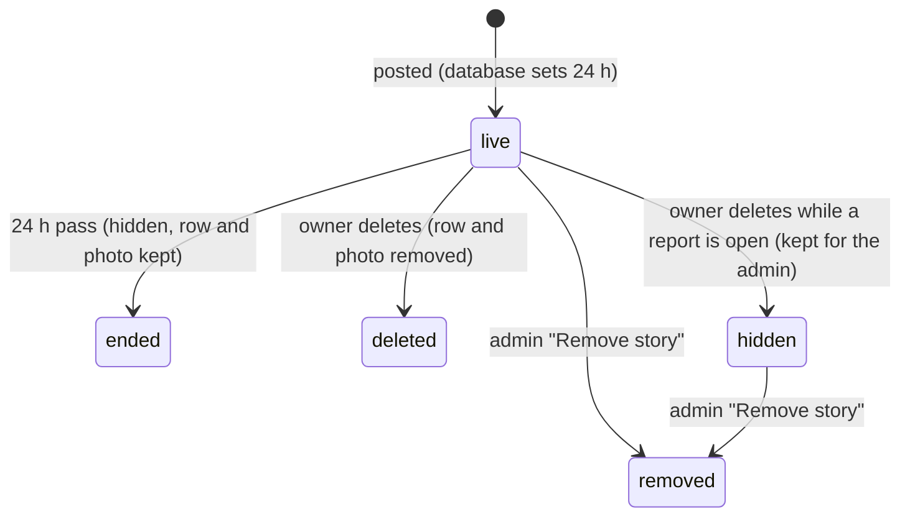
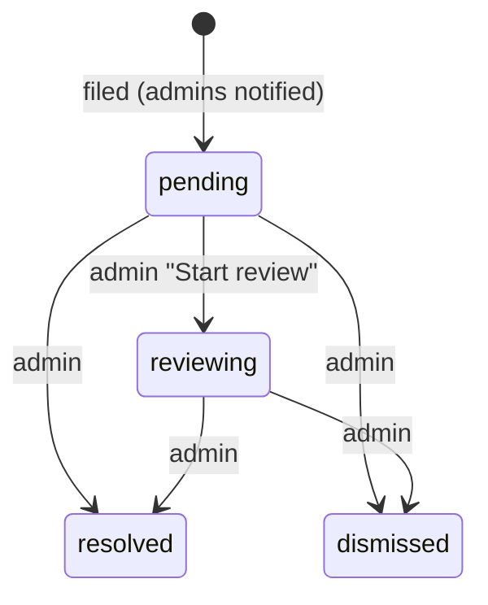
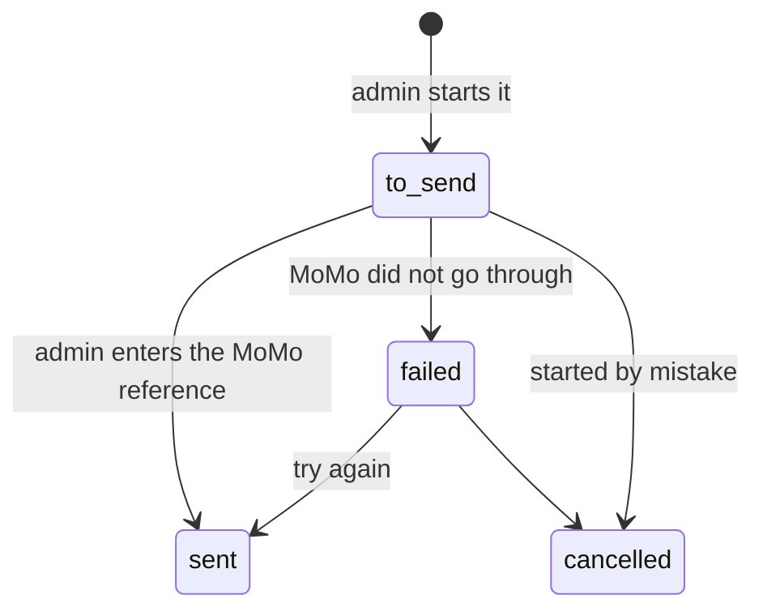

# 4. Life of each thing

*Checked 2026-10-05: the allowed values come from the live database rules
(CHECK constraints); "who moves it" comes from the code.*

Each thing in Unipicks goes through fixed stages. If something looks stuck,
find its stage here, then the step that should move it on.

---

## Order (`orders.status`)

| Status | Means | Moved on by |
|---|---|---|
| `pending_confirmation` | Waiting for the business (5 min) | `update-order-status`, `expire-orders` |
| `confirmed` | Accepted, student must pay within 5 min | `process-payment`, `expire-orders` |
| `payment_processing` | MoMo prompt sent, waiting for UmunotaPay | `payment-webhook` (or `reconcile-payments`, switched off) |
| `paid` | Money received, pickup code sent | Business enters the code |
| `redeemed` | Collected ✓ | — |
| `declined`, `confirmation_expired`, `payment_expired` | Ended without food (late money still makes it `paid`) | — |
| `refunded` | Allowed by the database, **not used yet** (refunds planned) | — |
| `completed`, `cancelled` | Allowed by the database, **never set** for orders | — |

**Dispute** (`orders.dispute_status`, beside the status above):

## Payment (`transactions.status`)

`pending` is allowed but not used by the current flow.

## Pickup code (`redemptions`)

`confirmed` / `failed` and the `payment_status` column belong to the old
pre-order flow (before orders, September 2026) and are **not updated** by the
current flow. Read the order's status instead.

## Group order (`group_orders.status`)

`group_order_members.payment_status` (`unpaid` / `pending` / `paid`) and the
table `group_order_payment_members` come from an earlier "each member pays"
design; the current flow submits **one order** for the whole group, owned by
the **host**, who pays the whole amount (`create-group-order-payment` sets the
order's student to the host). Members settle with the host themselves **[inference: nothing in the app records it]**.

## Business approval (`merchant_profiles.approved`)

Only an approved business **in good standing** (not banned) can publish deals
and receive orders.

## Friend request and message request

## Student story

🟡 Ended stories and their photos are **never cleaned up** (no timer job yet).

## Report (`student_reports.status`)

Target: first answer within **24 hours** (the admin screen marks late ones red).

## Refund (planned, approved 2026-10-05)

