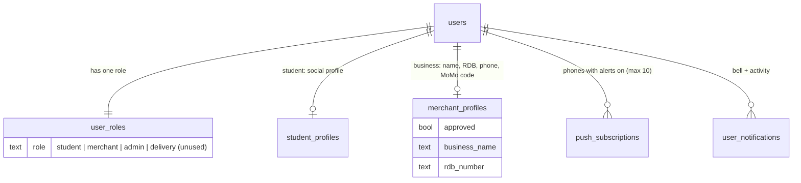
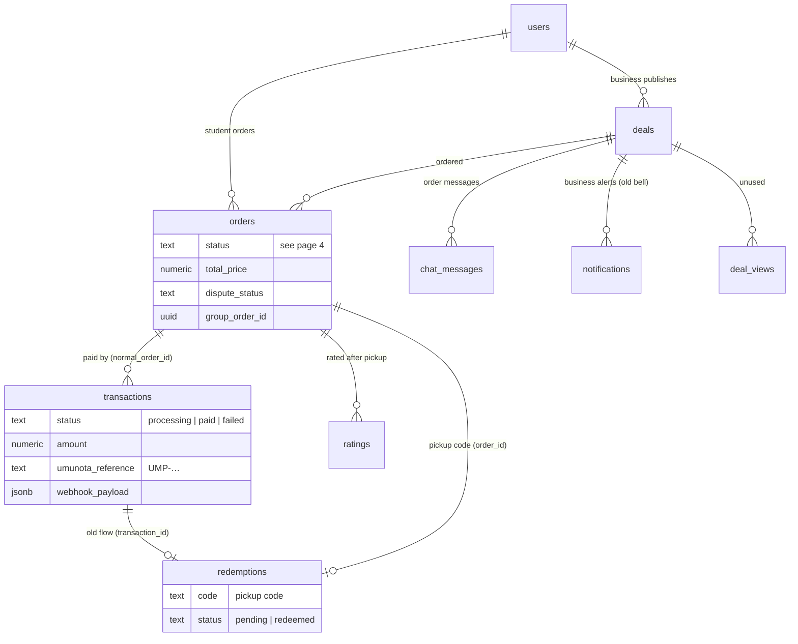
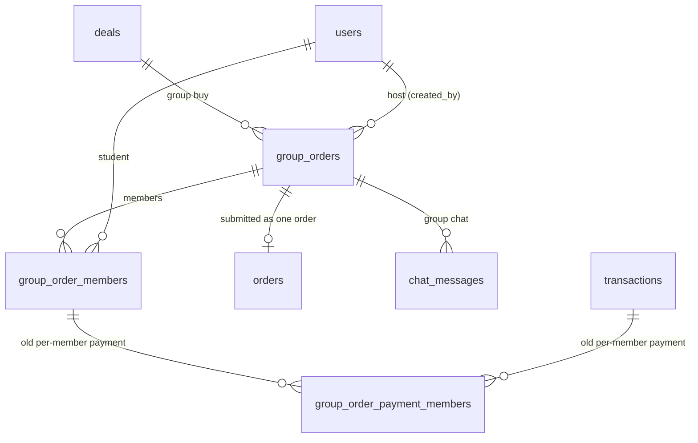
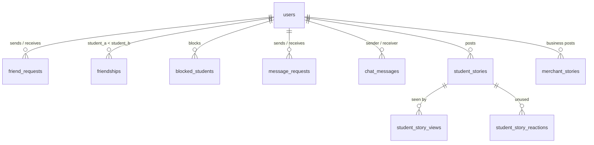
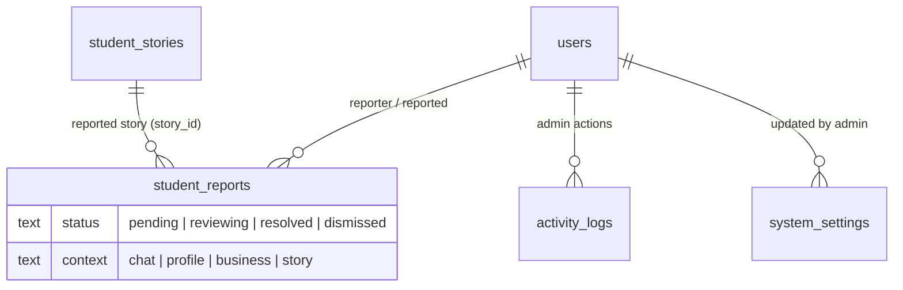

# 5. The data

*Checked 2026-10-05 against the live database: 32 tables in `public`, plus
Supabase's `auth.users`. Links are the real foreign keys.*

Every person is one row in `auth.users` (Supabase Auth). Almost every table
points to it. The diagrams below are grouped by area so they stay readable.
`users` in the diagrams = `auth.users`.

---

## A. Accounts and roles

- The role is set by the database at sign-up and cannot be changed from the app.
- Verified university and student ID live in `auth.users.raw_app_meta_data`
  (server-owned), not in a table.

## B. Deals, orders and money

- **One order ↔ one payment** in the current flow (`transactions.normal_order_id`).
- **The price is decided by the server** (`create-order`), never by the app.
- Refunds will add a `refunds` table linked to `orders` and `transactions`
  (plan approved 2026-10-05).

## C. Group orders

## D. Social

- Photos are not in tables: they are files in Storage (page 2); a story row
  keeps the file path.

## E. Moderation and admin

- Disputes are not a table: they are the `dispute_*` columns of `orders`.
- Bans are not a table: `banned` is in `auth.users.raw_app_meta_data`
  (checked by `is_banned`).

## What happens when an account is deleted

Account deletion keeps a "Deleted user" row (tombstone) instead of removing
the user, so these links never break:

| Kept (accounting, disputes, the other person) | Changed | Removed |
|---|---|---|
| orders, transactions, pickup codes, ratings, chat messages, reports, deals (switched off), activity log, blocks **against** them | phones on orders set to empty; names → "Deleted user"; rating texts emptied; deal photos removed | role (so they can't log in), student / business profile, friendships, friend and message requests, their own blocks, stories and views, business stories, notifications, group memberships, saved items, interests, views, searches; phones with alerts on (trigger) |

*(From `tombstone_user_core`, `20261003240000_fix_tombstone_transactions_payload.sql`.)*

## Tables the app does not use (yet)

`business_follows`, `deal_searches`, `deal_views`, `social_content_interactions`,
`student_interests`, `student_saved_items`, `student_story_reactions`,
`group_order_payment_members` (old group payment). They exist in the
database but no screen or server function reads or writes them. Keep them
(planned features) or remove them in a clean-up; either way they cause no
harm today.
