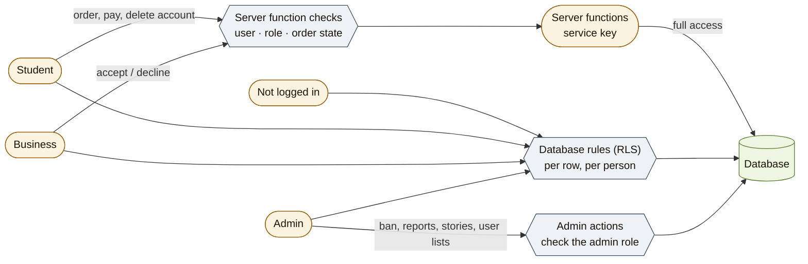

# 6. Who can see and do what

*Checked 2026-10-05 against the live database: all 32 tables have row rules
switched on (RLS); 82 rules in total (tables + Storage).*

**The idea:** the website asks the database for everything with the logged-in
person's token. The **database rules** decide, row by row, what that person
may read or change. Anything with money or several steps goes through a
**server function** that checks the person itself. So a changed or hacked app
still cannot see someone else's data or give itself rights.

## The roles

| Role | Comes from | Can never |
|---|---|---|
| **Not logged in** | — | See anything except live deals, business names and logos, and ratings |
| **Student** | Set by the database at sign-up (`user_roles`) | Change its role or university, see other students' orders or payments, publish deals |
| **Business** | Same, sign-up as business; must be **approved** | Approve itself, see orders of other businesses, sell while banned or not approved |
| **Admin** | Given by hand in the database (`user_roles.role = admin`) | Be deleted while still admin |
| **Server** (service key) | Only inside server functions | Is never sent to the website |
| `delivery` | Allowed by the database, **not used** | — |

## Who can read and change each main table

Every rule that checks "is this the signed-in user?" writes it as
`(SELECT auth.uid())`, so Postgres works out the user once per query, not once
per row (migration `20261009090000`, Supabase advisor `auth_rls_initplan`).
Write new rules the same way.

| Table | Not logged in | Student | Business | Admin | Changed by |
|---|---|---|---|---|---|
| `deals` | live deals of approved businesses | same | own deals (all), add/edit/delete own if approved | — | business; price and seller name checked by triggers |
| `orders` | — | own | own (as seller) | all | **server functions only** (no app writes) |
| `transactions` (payments) | — | own | — | all | **server functions only** |
| `redemptions` (pickup codes) | — | own | for own deals | — | server; used via `redeem_pickup_code` |
| `merchant_profiles` | — (name and logo through `get_businesses`) | — (also phone and address through `get_businesses` if an active student) | own; edit own (name/RDB change → re-approval) | all; approve, delete | business, admin |
| `student_profiles` | — | own only (others via search functions that respect blocks) | — | via `get_all_students` | student |
| `chat_messages` | — | own conversations; group chat if member; send only to friends / accepted requests / own business | own conversations with students who ordered | — | sender; receiver may only mark read |
| `group_orders`, members | — | groups they host or joined; join open groups | — | — | host, members, server |
| `student_stories` | — | own; friends' live stories | — | all (reports) | owner; database sets 24 h |
| `student_reports` | — | file; read own | file; read own | all; review | reporter, admin |
| `user_notifications` | — | own; mark read | own; mark read | own | triggers and server |
| `push_subscriptions` | — | own phones | own phones | own | `save_push_subscription` |
| `activity_logs` | — | — | — | read | admin actions, server |
| `refunds` | — | own (amount, status, note, MoMo reference) | refunds of own orders | all | **admin functions only** (no app writes): `admin_start_refund`, `admin_mark_refund_sent`, `admin_mark_refund_failed`, `admin_cancel_refund` |
| `ratings` | all (written reviews via `get_deal_reviews`: text for visitors, photo for signed-in people, the reviewer's name only for students they haven't blocked and admins) | rate own collected order, with an optional photo from their own folder (edit 24 h) | — | delete | student |
| `deal_likes` | — | own likes only; like live deals (not banned); remove own | — | — | student; others see counts only via `get_deals_social` (also: how many of my friends liked it and the newest one's name — blocked people never counted — and the comment count) |
| `student_saved_items` | — | own only (save / unsave) | — | — | student |
| `deal_comments` | number only (`get_deal_comment_count`) | read via `get_deal_comments` (names as for reviews; people you blocked hidden); write on live deals, reply one level (not to someone who blocked you), 10 per 10 min; delete own | write and reply on **own** deals; delete own; can't delete students' comments | read, delete any | author; alerts by trigger |

## Business details (founder decision 2026-10-10)

Nobody reads other businesses from the table itself. Instead:

- `get_businesses(ids)` (anyone): name and logo of approved businesses in good
  standing; phone and address only for an active student (not banned) or an
  admin. Never the RDB number or MoMo pay code. Pending businesses never appear.
- `get_receipt_seller(order)` (signed in): the seller's name, address and RDB
  number, only for that order's student, its business or an admin.
- `search_merchants(text)` (signed in): approved businesses by name; address
  only for active students and admins; never the owner's personal name.

This replaces the 2026-10-03 decision that business phone and MoMo pay code
were public (no student screen shows the pay code; students pay in the app).

## Your own data

`export_my_data()` (signed in): one JSON file with everything stored about
the caller — Profile → Settings → Download my data. Leaves out password data,
payment-provider payloads, phone-alert keys and reports filed against them. Refunds are included (`20261010150000`): the student's own, and for a business the refunds on its orders with who paid; never which admin handled them.

## Admin-only actions (each checks the admin role itself)

`admin_ban_user`, `admin_unban_user`, `admin_delete_user`,
`get_all_students`, `get_all_merchants`, `get_admin_reports`,
`review_report`, `admin_remove_story`, `admin_remove_avatar`, `admin_remove_review`, `admin_remove_comment`, `log_admin_action`,
`resolve_order_dispute`, `admin_start_refund`, `admin_mark_refund_sent`,
`admin_mark_refund_failed`, `admin_cancel_refund` (refunds: amount never more
than what is left on the payment; one open refund per order; each step logged
in `activity_logs`).

**Business-only:** `request_cant_serve(order, reason, note)` — the order's
business, not banned, paid order not collected; tells the student and every
admin; an admin decides the refund.

## Checks that run whoever writes (triggers)

| Check | Protects |
|---|---|
| Banned accounts cannot message, request, post stories, order, join or start groups, raise disputes, report | Safety (`20261003200000_enforce_bans.sql`) |
| A deal must have a student price; the seller name comes from the profile | Honest prices, no impersonation |
| A business cannot approve itself; a name / RDB change sends it back for approval | Impersonation |
| Stories: students only, own folder, images only, 24 h set by the database, kept while reported | Privacy, evidence |
| University and student ID are set by the server from the email | Fake students |
| Messages: receivers can only mark them read | Chats as dispute evidence |
| An order can't be marked collected while a refund on it is open | Food *and* money back (`block_pickup_during_refund`) |
| An account can't be deleted while a refund on its orders is open | The refund needs the phone on the order |

## The private schema

Social and role functions keep their code in the `private` schema (page 2);
only signed-in users may use it, and every function there is closed to
visitors who are not logged in. Eleven table rules call `private.is_admin()`,
which gives the same answer as `public.is_admin()`.

## Photos (Storage)

See page 2. In short: deal photos, business stories and logos are **public
links**; student stories are **private** (friends while live, owner, admins).
