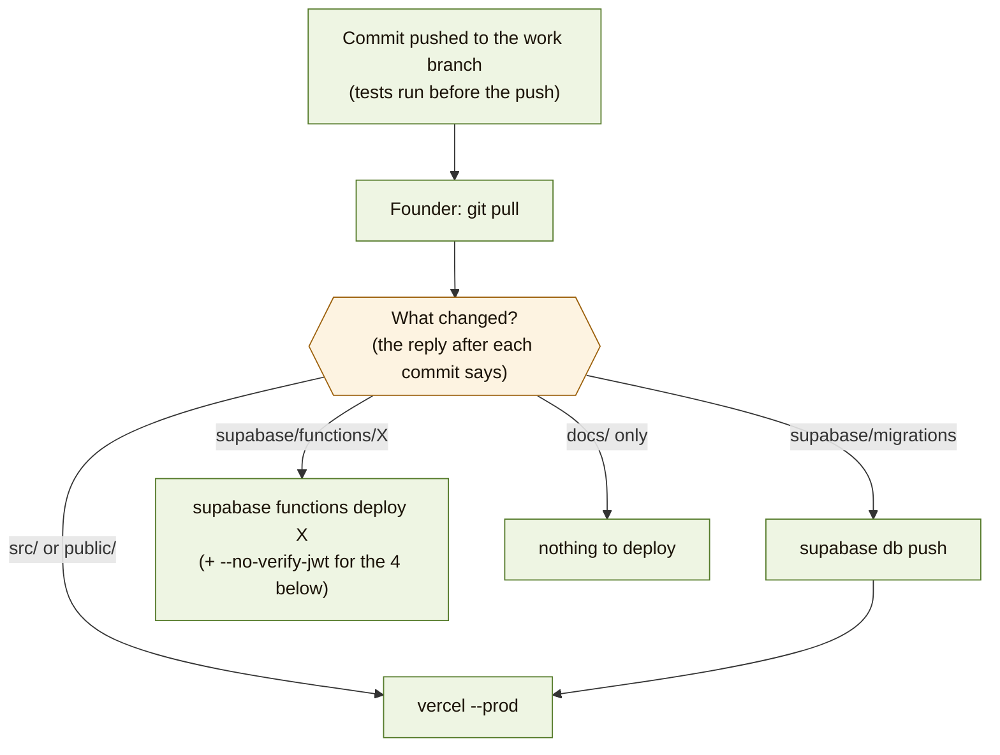

# 7. Running it

*Checked 2026-10-05. Values of secrets are never written here, only names.*

Where each part lives, how a change goes live, where to look when something
breaks.

## Where everything lives

| Part | Where | Who can change it |
|---|---|---|
| Code | GitHub `tangaza360-max/unipicks` (work branch `claude/unipicks-codebase-audit-9vd6fb`) | Founder (merges to `main`) |
| Website | Vercel team `tangaza360-2401`, project `unipicks` → https://unipicks.vercel.app | Founder (`vercel --prod`) |
| Database, Auth, Storage, Realtime, server functions | Supabase project `dylgephsnywowxxasifs` | Founder (`supabase db push`, `supabase functions deploy`) |
| Timer | cron-job.org: `POST …/functions/v1/expire-orders` every minute, header `x-cron-secret` | Founder |
| Payments | UmunotaPay dashboard (testing until "Become Live" is approved) | Founder |
| Error reports | Sentry (EU) | Founder |

## How a change goes live

Order when several parts change: **database first**, then server functions,
then the website (the new website may need the new database rules).

**Server functions that must keep the Supabase login check off**
(they check the caller themselves): `create-order`, `update-order-status`,
`process-payment`, `payment-webhook`, so deploy them with `--no-verify-jwt`.
All others deploy without the flag.

**Going back:** website → Vercel dashboard → an older deployment → "Promote"
(or `vercel rollback`). Database → never edit an old migration; write a new
one that undoes the change.

## Secrets (set in Supabase → Edge Functions → Secrets)

| Name | Used by | Notes |
|---|---|---|
| `SUPABASE_SERVICE_ROLE_KEY`, `SUPABASE_URL`, `SUPABASE_ANON_KEY` | all functions | set by Supabase |
| `UMUNOTA_API_KEY`, `UMUNOTA_WEBHOOK_SECRET` | `process-payment`, `payment-webhook`, `reconcile-payments` | **change when UmunotaPay goes live** if they give new keys |
| `UMUNOTA_WEBHOOK_ALLOWED_IPS` | `payment-webhook` | optional |
| `UMUNOTA_STATUS_ENDPOINT`, `UMUNOTA_STATUS_METHOD`, `UMUNOTA_STATUS_AUTH_STYLE`, `RECONCILE_ENABLED` | `reconcile-payments` | not set yet (switched off) |
| `CRON_SECRET` | `expire-orders`, `reconcile-payments` | same value in cron-job.org |
| `VAPID_PUBLIC_KEY`, `VAPID_PRIVATE_KEY`, `VAPID_SUBJECT` | phone alerts | private key only in `~/unipicks-vapid.json` on the founder's laptop |
| `GEMINI_API_KEY`, `UNSPLASH_ACCESS_KEY` | `generate-deal` | |

Website settings (Vercel → Settings → Environment Variables, public values):
`VITE_SUPABASE_URL`, `VITE_SUPABASE_ANON_KEY`, `VITE_VAPID_PUBLIC_KEY`,
`VITE_SENTRY_DSN`, `VITE_SUPPORT_EMAIL`, `VITE_UNIPICKS_REGISTRATION`.
Today the build takes them from the `.env` file in the code, which holds
**public values only** (`VITE_SUPABASE_URL`, `VITE_SUPABASE_ANON_KEY`,
`VITE_SENTRY_DSN`, `VITE_VAPID_PUBLIC_KEY`; checked 2026-10-05).
🟡 Still open: some Vercel variables were found misnamed (`ITE_SUPABASE_*`);
rename or delete them so nobody relies on them by mistake.

## Website security headers (`vercel.json`)

Every page is sent with a **Content Security Policy** and four more headers
(added 2026-10-08, OWASP Secure Headers). The policy is an allow-list of the
outside services the website may use:

| Kind | Allowed |
|---|---|
| Data and live updates | our Supabase project (`https://` and `wss://`), Sentry (`*.sentry.io`), the leaked-password check (`api.pwnedpasswords.com`) |
| Styles and fonts | Google Fonts |
| Pictures and videos | any `https:` site (deal photos, business logos), `data:`, `blob:` (camera) |
| Scripts, phone helper, app manifest | only Unipicks itself |
| Being shown inside another site | **never** (stops clickjacking) |

Also: `X-Frame-Options: DENY`, `X-Content-Type-Options: nosniff`,
`Referrer-Policy: strict-origin-when-cross-origin`, `Permissions-Policy`
(camera for Unipicks only; microphone, location, payment and USB off).
HTTPS-only (HSTS) is already sent by Vercel itself.

⚠️ **Adding a new outside service** (another Supabase project, a payment
page, analytics, a CDN for scripts) means adding it to the policy in
`vercel.json` in the same commit, or the browser blocks it. If something
stops loading after a deploy, open the browser console: a blocked request
shows "Refused to … because it violates the following Content Security
Policy directive".

## Where to look when something breaks

| Symptom | Look first | Then |
|---|---|---|
| Students can't pay / MoMo prompt never comes | Supabase → Edge Functions → `process-payment` → Logs | UmunotaPay dashboard → History; are the keys test or live? |
| Order stuck on "payment in progress" | `payment-webhook` logs (did the callback arrive?) | UmunotaPay → webhook deliveries (can be replayed); later `reconcile-payments` |
| Orders never expire | cron-job.org history (200 OK every minute?) | `expire-orders` logs; `CRON_SECRET` matches |
| No phone alerts | The person turned alerts on? (`push_subscriptions`) | function logs `[web-push]`; VAPID keys match the website's public key |
| Business can't publish or receive orders | Admin → Approvals (approved?), Users (banned?) | `is_merchant_in_good_standing` |
| Student sees "Price not set" | The deal has no student price | Business edits the deal |
| Can't confirm email / reset password | Supabase → Auth → Logs | email sender (page 1) |
| Screen crashes | Sentry | Vercel deployment logs |
| Something no longer loads after a deploy (picture, live update, error reports) | Browser console: "violates the following Content Security Policy" | add that site to `vercel.json` (see Website security headers) |
| A screen shows old data after a deploy | Phone helper not updated yet | close and reopen the app (it updates itself on reopen) |
| Something is slow or failing in the database | Supabase → Logs → Postgres | Supabase → Advisors |

## Tests (run before every push)

| What | Command | How many |
|---|---|---|
| Server functions and shared helpers | `deno test --import-map=supabase/functions/tests/import_map.json --allow-env --allow-read supabase/functions/tests/` | 17 files |
| Database rules (each builds a fresh local database from all migrations) | `bash supabase/tests/<name>.test.sh` | 15 files |
| Screens (phone size, light and dark) | Playwright scripts with a fake Supabase (kept outside the repo so far) | per change |

🟢 Idea: move the screen tests into the repo and run all tests on GitHub on
every push (GitHub Actions).
