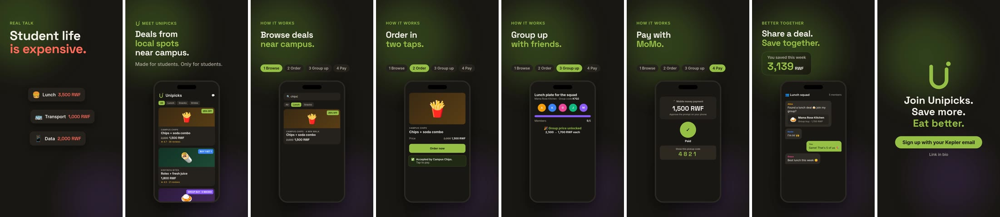
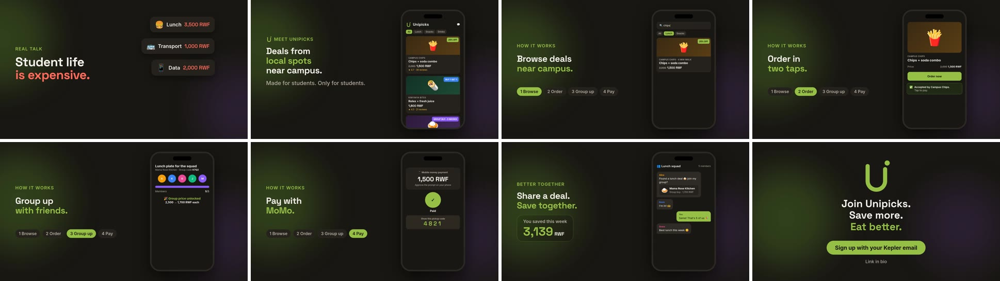

# Unipicks — 30-Second Explainer: Storyboard

Exact time codes from `explainer.html` (the source of truth; every value below is a delay in that file). Frame numbers are at 30 fps.

**Layout:**
- **Vertical (1080×1920):** text block at the top (safe zone 17–60% of the height), phone mockup in the lower half. Nothing important is in the bottom ~15% or top ~8%, where Reels/TikTok put their UI.
- **16:9 (1920×1080):** text on the left, phone on the right.
- **Palette:** background `#191713`, lime `#95BF47` (both from `public/manifest.json`), coral `#FF6B5B` for "expensive" and prices.
- **Type:** Space Grotesk (headlines) and Inter (body), the app's own fonts.

---

## Scene 1 · Hook: "Student life is expensive" · 0:00–0:05 (frames 0–149)

| Time | Action |
|---|---|
| 0.10 s | Kicker "REAL TALK" fades up |
| 0.25 s | "Student life" fades up |
| 0.60 s | "is expensive." fades up in coral |
| 1.2 / 1.7 / 2.2 / 2.7 s | Price tags pop in, alternating left and right: Lunch 3,500 · Transport 1,000 · Data 2,000 · Snacks 1,500 RWF |
| 3.2 s | 👛 wallet pops in, then shakes 3× from 3.7 s |
| 3.4 s | "And the month is long. 😩" |
| 4.6 s | Scene scales down and fades out |

**Purpose:** a relatable pain point in the first second, which stops the scroll. The coral colour signals "problem".

## Scene 2 · Solution: "Meet Unipicks" · 0:05–0:12 (frames 147–359)

| Time | Action |
|---|---|
| 4.9 s | Scene fades in |
| 5.1 s | Kicker with logo mark: "MEET UNIPICKS" |
| 5.3 / 5.6 / 5.9 s | "Deals from" / "local spots" (lime) / "near campus." |
| 6.6 s | "Made for students. Only for students." |
| 6.9 s | Phone slides up from below |
| 7.5 / 7.8 / 8.1 s | Deal cards appear: Campus Chips 25% OFF · Kinyinya Bites BUY 1 GET 1 · Mama Rose Kitchen GROUP BUY · 5 NEEDED (the real app's three badge colours: lime, blue, purple) |
| 9.4 s | Chip "🎓 Verified with your Kepler email" pops |
| 9.6–12 s | Feed gently scrolls up |
| 11.6 s | Fade out |

**Purpose:** name the product and its one-line promise. Show the real app's look (deal cards, offer badges, star ratings).

## Scene 3 · How it works: four beats · 0:12–0:20 (frames 357–599)

A step-pill row (1 Browse · 2 Order · 3 Group up · 4 Pay) stays on screen; the active step turns lime. The headline and phone screen swap every 2 s.

| Time | Beat | Phone screen |
|---|---|---|
| 12.0–13.9 s | **Browse deals near campus.** | Search bar types "chips" (from 12.4 s); "Lunch" chip active; Campus Chips card pops at 13.0 s |
| 14.0–15.9 s | **Order in two taps.** | Deal detail; tap ripple on "Order now" at 14.7 s; toast "✅ Accepted by Campus Chips. Tap to pay." at 15.1 s |
| 16.0–17.9 s | **Group up with friends.** | Group "Lunch plate for the squad", code K7Q2; avatars G, J, M join at 16.5 / 16.8 / 17.1 s; progress bar fills; counter 2/5 → 5/5; "🎉 Group price unlocked, 2,500 → 1,700 RWF each" at 17.3 s |
| 18.0–20.0 s | **Pay with MoMo.** | "Mobile money payment, 1,500 RWF, approve the prompt on your phone" → ✓ Paid at 18.8 s → pickup code **4821** at 19.15 s |

**Purpose:** the whole order loop (discover → order → group → pay → pickup code) as the app actually works it, in 8 seconds.

## Scene 4 · Joy and social proof · 0:20–0:27 (frames 597–809)

| Time | Action |
|---|---|
| 20.1–20.5 s | "BETTER TOGETHER" / "Share a deal." / "Save together." (lime) |
| 20.6 s | Group chat: Aline shares a Mama Rose Kitchen deal card, "join my group?" |
| 21.4 / 22.1 / 23.3 / 24.2 s | Kevin "I'm in! 🙌" · You "Same! That's 5 of us 🎉" · Grace "Best lunch this week 😋" · Jean "Tomorrow: chips deal? 🍟" |
| 22.6 s | Savings card pops; counter runs 0 → **3,200 RWF** (22.9–24.4 s, ease-out) |
| 24.5–27 s | Confetti (🎉 ✨ 🍟 🍛 💚 🌯 ⭐) falls (seeded, identical on every render) |
| 26.6 s | Fade out |

**Purpose:** the emotional payoff: friends, food, money saved. The social loop (share, then group) is Unipicks' growth engine (product doc §20).

## Scene 5 · CTA · 0:27–0:30 (frames 804–899)

| Time | Action |
|---|---|
| 26.9 s | Unipicks "U" logo draws itself (stroke animation); dot pops at 27.6 s |
| 27.2 / 27.55 / 27.9 s | "Join Unipicks." / "Save more." / "Eat better." (lime) |
| 28.4 s | Lime button: "Sign up with your Kepler email" |
| 28.8 s | "Link in bio" |
| 28.8–30.0 s | Hold (about 1.2 s of clean end card for the viewer to act) |

---

## Editing notes for CapCut (adding audio)

1. Import `unipicks-explainer.mp4`. Don't trim; it's exactly 30.0 s.
2. Add music (see `assets.md`) and line up a beat or drop on **5.0 s** (the reveal) and a hit on **27.2 s** (the CTA).
3. Duck the music to about −18 dB under the voiceover.
4. Optional sound effects: pop on each price tag (1.2–2.7 s), tap at 14.7 s, cash/ding at 18.8 s, whoosh at scene changes (4.9, 11.9, 19.9, 26.8 s).
5. Turn on auto-captions only if you record a voiceover. The on-screen text already covers sound-off viewing, so captions would duplicate it.
